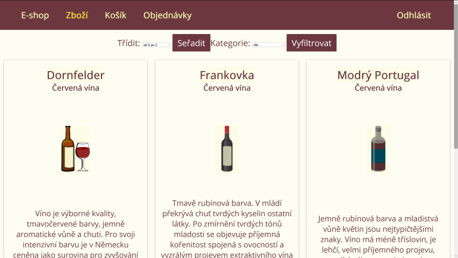

[![Build Status][build-shield]][build-url]
[![MIT License][license-shield]][license-url]

<!-- PROJECT LOGO -->
 

  

  <h3 align="center">E-shop Node.js</h3>

  

    Node-shop with admin interface. 
     

## Table of Contents

- [About the Project](#about-the-project)
  - [Built With](#built-with)
  - [Installation](#installation)
- [License](#license)
- [Contact](#contact)

<!-- ABOUT THE PROJECT -->

## About The Project

  
   
Simple server rendered web application. Sort items by price or name.  
Add items to the cart. Modify cart by plus, minus butons or enter integer into input field.  
Create order and print pdf file.  
Register, login and reset your password.  
With admin access create and modify new shop items.  Configure inventory, pictures, price. Display sales on homepage

### Built With

- [Node](https://nodejs.org)
- [Express](https://expressjs.com)
- [EJS](https://ejs.co)
- [Mongoose](https://mongoosejs.com)
- [Nodemailer](https://nodemailer.com)

### Installation

1. Create a folder to hold your installation: mkdir node-shop
2. FTP/Copy the contents of the zip to your newly created folder

3. Install dependencies: npm install

4. Enter your API variables in `.env` file
   const API_KEY = 'ENTER YOUR API';

5. Start application: npm start

6. Visit http://localhost:3000 in your browser

## License

Distributed under the MIT License. See `LICENSE` for more information.

<!-- CONTACT -->

## Contact

andrewtomanek - andrewtomanek@gmail.com

Project Link: [https://github.com/andrewtomanek/node-shop](https://github.com/andrewtomanek/node-shop)

[build-shield]: https://img.shields.io/badge/build-passing-brightgreen.svg?style=flat-square
[build-url]: #
[license-shield]: https://img.shields.io/badge/license-MIT-blue.svg?style=flat-square
[license-url]: https://choosealicense.com/licenses/mit
[linkedin-shield]: https://img.shields.io/badge/-LinkedIn-black.svg?style=flat-square&logo=linkedin&colorB=555
[linkedin-url]: https://linkedin.com/in/othneildrew
[product-screenshot]: https://raw.githubusercontent.com/othneildrew/Best-README-Template/master/screenshot.png
